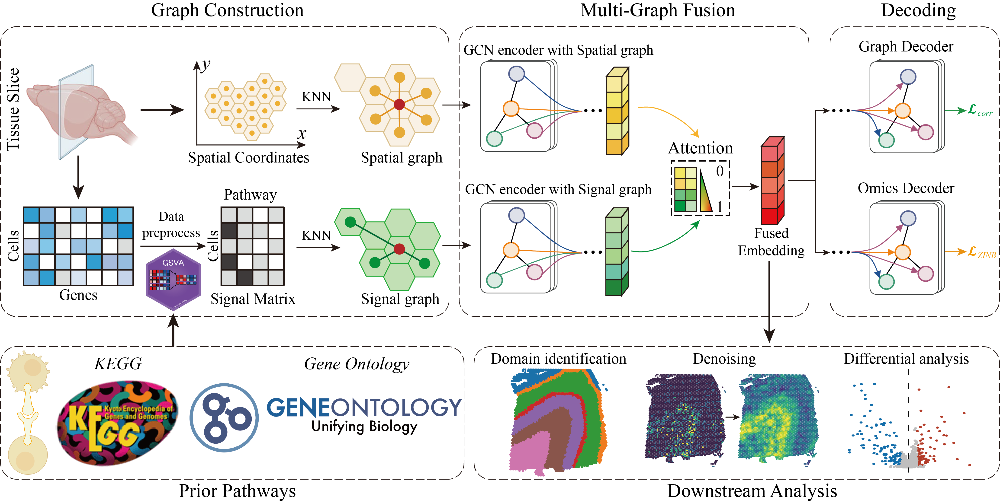

## Signal-based spatial domain identification of spatially resolved transcriptomics with multi-graph fusion

###  Yaxiong Ma, Yu Wang, Xiaoke Ma

### Contact:

We are continuing adding new features. Bug reports or feature requests are welcome.

Last update: 09/25/2025, version 1.0.0

Please send any questions or found bugs to Xiaoke Ma [xkma@xidian.edu.cn](mailto:xkma@xidian.edu.cn).

### Reference

Our paper is under review.

