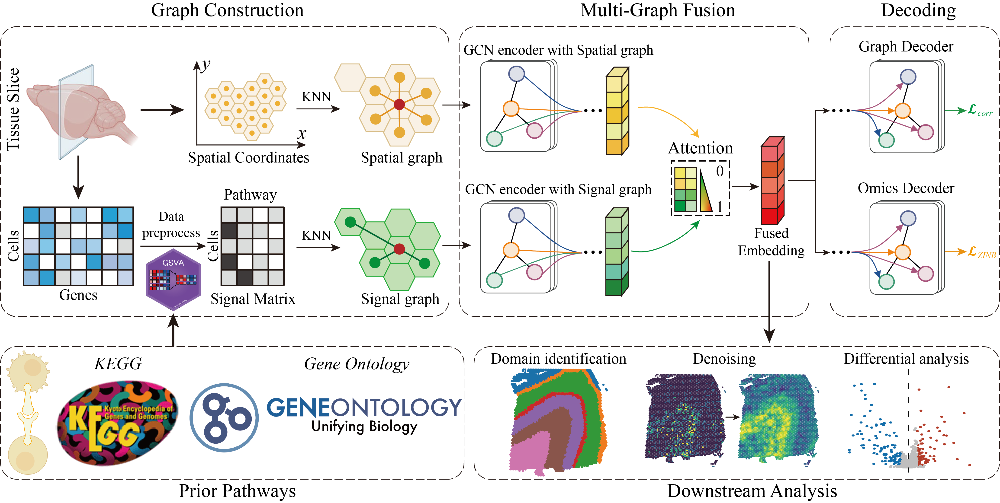

## Signal-based spatial domain identification of spatially resolved transcriptomics with multi-graph fusion

###  Yaxiong Ma, Yu Wang, Xiaoke Ma

### Contact:

We are continuing adding new features. Bug reports or feature requests are welcome.

Last update: 04/05/2026, version 1.1.0

Please send any questions or found bugs to Xiaoke Ma [xkma@xidian.edu.cn](mailto:xkma@xidian.edu.cn).

## Acknowledgments

We would like to express our gratitude to the following projects and researchers for their inspiring work:
* The common procedure for data preprocessing is also adopted by **[Path-MGCN](https://github.com/gdut-zqr/Path-MGCN)**. 
* Our multi-graph fusion strategy was reference to the methodologies in **[Spatial-MGCN](https://github.com/cs-wangbo/Spatial-MGCN)**.

### Reference

Our paper is accepted at Briefings in Bioinformatics: https://academic.oup.com/bib/article/27/1/bbag052/8472822

Please also consider citing the following references:

1. Zhou Q, Li C, Chen C, et al. **Path-MGCN**: a pathway activity-based multi-view graph convolutional network for determining spatial domains[J]. *Briefings in Bioinformatics*, 2025, 26(4): bbaf365.
2. Wang B, Luo J, Liu Y, et al. **Spatial-MGCN**: a novel multi-view graph convolutional network for identifying spatial domains with attention mechanism[J]. *Briefings in Bioinformatics*, 2023, 24(5): bbad262.

